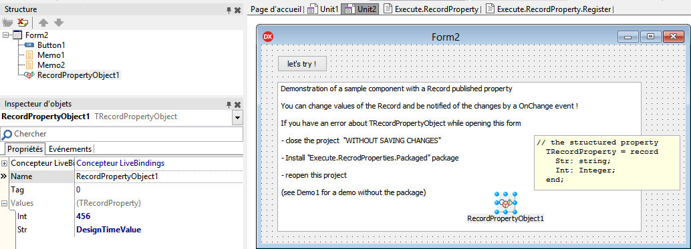

# Sample component with a published Record property

Delphi do not supports published Record properties, if you want to create a complex property, you have to create a subcomponent.

This demonstration shows how to publish a Record property under Delphi Tokyo

Note that the code needs to handle the fact that Delphi do not provide RTTI Informations for Record properties.
[RSP-19303](https://quality.embarcadero.com/browse/RSP-19303)

## How does it work ?

1- create a record (TRecordProperty in my code)

2- create an helper to publish this property (TRecordPropertyHelper)

it's not a "record helper", it's just a record with public properties that match the previous record properties with only a pointer to the owner's object. This allows to call FOnChange when you change a property.

3- the component need both records, one to store the values, the other to publish them.

4- the component need also to register custom properties for the record because Delphi will not handle them (this could be done with a [JSON serializer](https://github.com/tothpaul/LetsEncryptDelphi/blob/master/lib/Execute.JSON.pas) BTW)

this if for runtime code when you type "Component.Values.Str := 'xxx'" for instance, 
now we want the properties in the object inspector; for that you'll need to register a PropertyEditor.

I've created a TRecordPropertyProxy, a TPersistent class that publish the record properties so Delphi can deal with that without other hacks (see [RSP-19303](https://quality.embarcadero.com/browse/RSP-19303), and [RSP-20848](https://quality.embarcadero.com/browse/RSP-20848)).